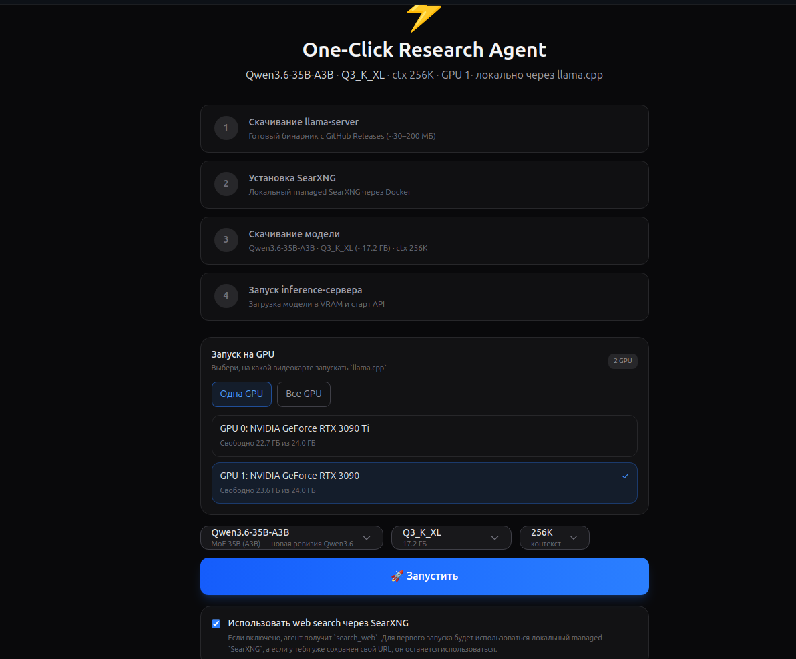
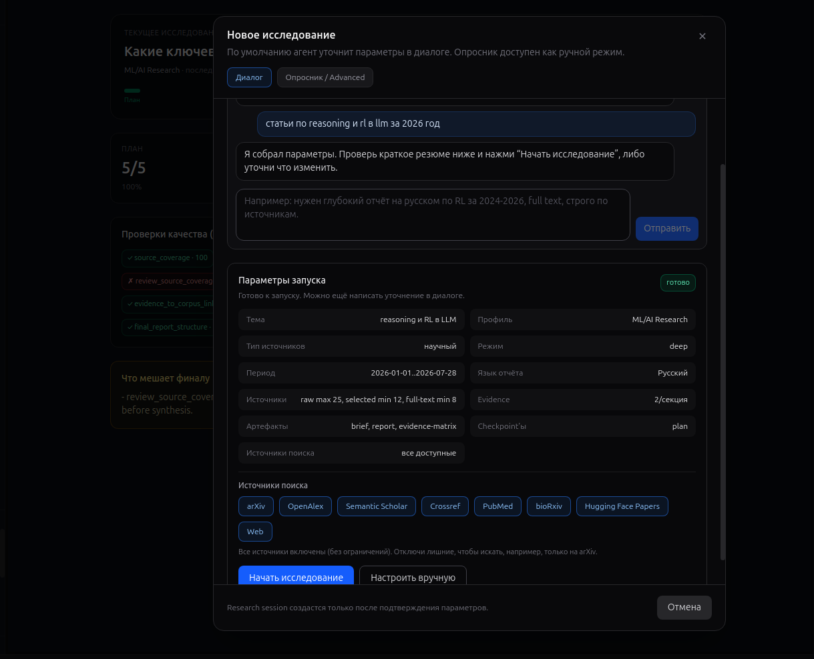
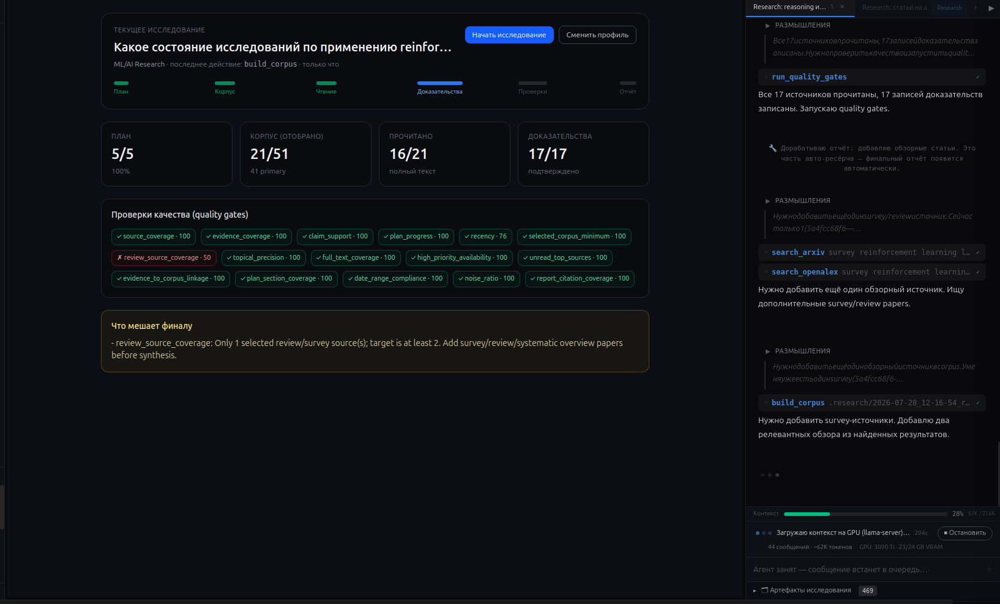
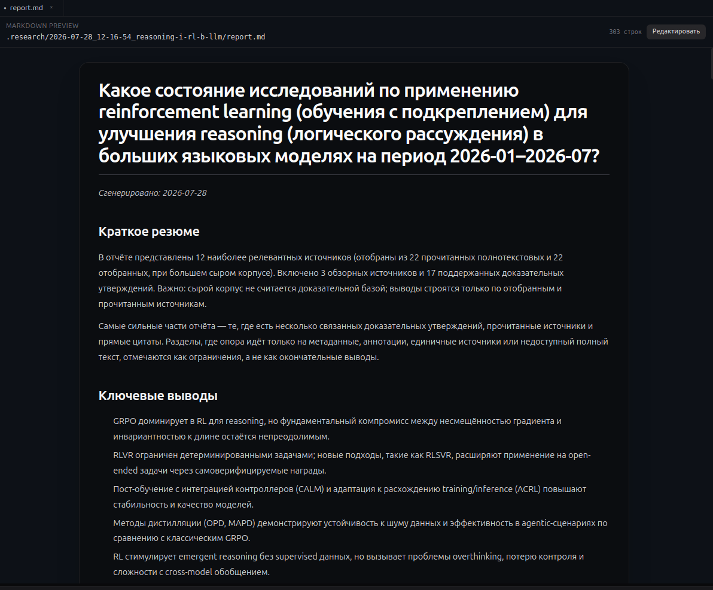
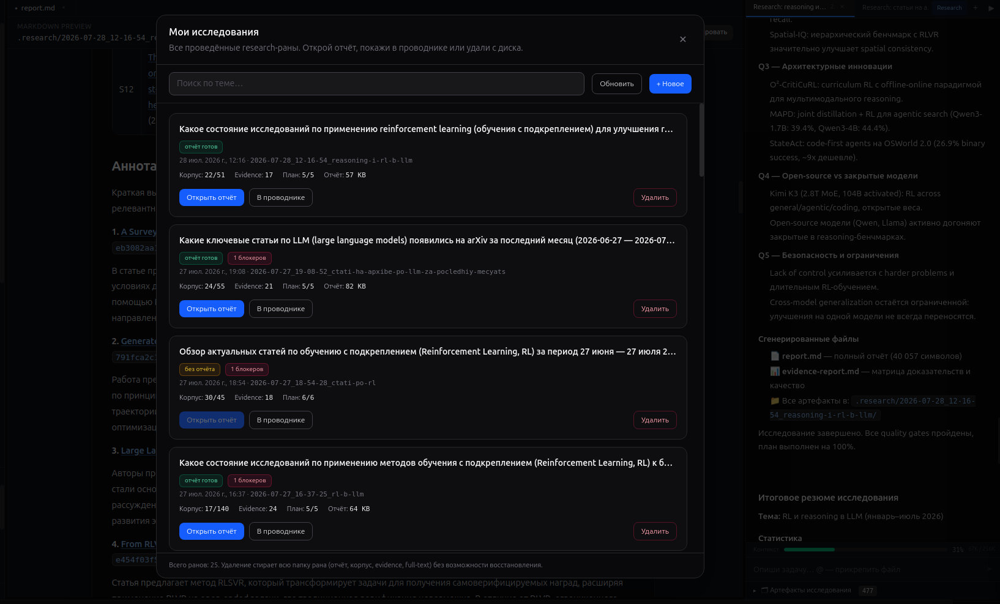

# One-Click Research Agent

English version: [`README_EN.md`](README_EN.md)

`one-click-research-agent` — это desktop-приложение (Electron + React) с автономным ИИ-агентом и локальной LLM (через `llama.cpp`) для исследовательской работы. Это агент общего назначения: он работает с вашими файлами, выполняет команды, ищет в вебе и научных индексах, читает документы и помогает разбираться в теме — целиком на вашей машине, без отправки данных во внешние AI API.

Одна из его ключевых функций — **управляемое глубокое исследование** (deep research): агент планирует, ищет источники, читает полные тексты, извлекает доказательства с цитатами, прогоняет проверки качества и собирает финальный отчёт от начала до конца.



## Что это

Помимо обычной агентной работы (чтение и правка файлов, запуск команд, поиск), его флагманская функция — управляемый **deep research**, который умеет:

- вести исследование темы как управляемый пайплайн, а не как один ответ модели;
- искать по научным индексам (arXiv, OpenAlex, PubMed и др.) и по вебу;
- читать полные тексты статей (HTML/PDF) и извлекать из них доказательства с точными цитатами;
- проверять качество результата через набор quality gates;
- собирать структурированный отчёт с матрицей доказательств и ссылками;
- хранить все артефакты локально в папке `.research/`.

Три продуктовых принципа:

- **Local-first** — файлы, источники, доказательства и отчёты остаются у вас.
- **Open-source-only** — работа через локальный `llama.cpp`, без зависимости от проприетарных API.
- **Agentic workflows** — система читает, запускает, проверяет и синтезирует, а не только генерирует текст.

## Скриншоты

| Новое исследование | Ход исследования |
|---|---|
|  |  |

| Финальный отчёт | Библиотека исследований |
|---|---|
|  |  |

## Ключевые возможности

- **Управляемый deep-research workflow** (`managed-deep-v1`): конечный автомат со стадиями `INIT → PLANNED → CORPUS_READY → READING → EVIDENCE → GATES → REPORT_READY`.
- **Диалог нового исследования с LLM-intake**: вы описываете задачу обычным текстом (тема, период, язык, глубина, ограничения), модель сама заполняет параметры запуска; есть и ручной режим.
- **Quality gates**: перед отчётом проверяются покрытие плана и источников, свежесть, соответствие датам, тематическая точность, наличие обзоров, привязка доказательств к корпусу, покрытие цитат и др.
- **Evidence-grounded отчёт**: каждое утверждение опирается на прочитанный источник и цитату; отдельно помечается сила доказательства (`strong` / `quote-backed` / `limited`).
- **Выбор и ограничение источников поиска**: можно разрешить только нужные движки (например, «только arXiv») — ограничение соблюдается жёстко на уровне доступных агенту инструментов.
- **Полнотекстовое чтение**: HTML/PDF, разбор в markdown, fallback на открытые версии (arXiv/OpenAlex OA) для закрытых DOI.
- **Языконезависимость**: агент читает источники на любом языке и пишет отчёт на выбранном вами.
- **Библиотека исследований**: список прошлых прогонов с просмотром отчётов и удалением с диска.
- **Очередь сообщений**: пока агент работает, можно набирать следующие задачи — они складываются в стопку и выполняются по очереди.
- **Редактируемые промпты**: все системные промпты вынесены в файлы `prompts/*.md` и могут переопределяться пользователем.
- **Управление локальным сервером**: setup модели, обновление `llama.cpp` до свежей версии в один клик, опция GPU keep-warm против простоя видеокарты.

## Как работает управляемое исследование

1. **План** — агент формулирует главный вопрос и под-вопросы, сохраняет `plan.md` и (по умолчанию) останавливается на утверждение.
2. **Поиск и корпус** — выполняет несколько целевых запросов по разрешённым источникам, собирает `corpus.jsonl` и ранжирует кандидатов.
3. **Скрининг** — семантический (LLM) + детерминированный отбор по релевантности, датам и типу источника; строгий период дат соблюдается по дням.
4. **Чтение** — загружает полные тексты отобранных статей (в `fulltext/`).
5. **Доказательства** — извлекает утверждения с цитатами в `evidence.jsonl`, привязывает к пунктам плана.
6. **Quality gates** — прогоняет проверки; при провале точечно чинит (добрать источники, дочитать, довыделить доказательства). Есть защита от зацикливания: недостижимые по объёму источников гейты честно понижаются до предупреждений.
7. **Отчёт** — генерирует `report.md`: краткое резюме, ключевые выводы, матрица направлений (покрытие/сила доказательств), доказательная база со ссылками.

## Источники поиска

Научные индексы и веб:

- `search_arxiv`, `search_openalex`, `search_semantic_scholar`, `search_crossref`, `search_pubmed`, `search_biorxiv`, `search_huggingface_papers`, `search_web` (через SearXNG).

В диалоге нового исследования можно выбрать, какие источники использовать. Если оставить не все — агент физически не сможет обратиться к остальным (жёсткое ограничение), и будет расширять запросы/сдвигать окно дат в пределах разрешённых источников.

## Приватность

- локальные файлы — основной источник истины;
- research-артефакты остаются локальными, пока вы сами не экспортируете;
- вычисления идут на локальной open-source модели через `llama.cpp`;
- в дизайне нет зависимости от облачных AI API.

## Установка и запуск

Готовые сборки (AppImage / .deb для Linux) — на странице [Releases](../../releases).

Из исходников:

```bash
npm install      # установка зависимостей
npm run dev      # запуск в режиме разработки
npm run build    # сборка renderer + electron
npm run package:linux  # пакет для Linux (AppImage + deb)
```

## Первый запуск

1. Запустите приложение (`npm run dev` или готовую сборку).
2. Дайте setup wizard подготовить локальную модель и сервер `llama.cpp`.
3. Откройте рабочую директорию.
4. Нажмите «Новое исследование», опишите задачу текстом — модель заполнит параметры.
5. Проверьте сводку (тема, период, язык, источники), при желании ограничьте источники и нажмите «Начать исследование».
6. Утвердите план — дальше агент работает автономно до `report.md`.

## Настройки

В панели настроек доступно:

- выбор модели и режима GPU, обновление `llama.cpp` и рестарт сервера;
- **GPU keep-warm** — периодические «пинги», удерживающие видеокарту в рабочем состоянии (обход некоторых драйверных багов простоя);
- **бюджет ИИ-отбора источников** — сколько времени давать LLM на семантический скрининг;
- web search через `SearXNG`: `disabled` / `managed local` (Docker) / `custom URL`;
- research-пресеты и профили (`Universal`, `ML/AI`, `Biology`, `Math`, `Finance`, `Paper Reproduction` и др.);
- редактирование системных промптов.

## Артефакты `.research/`

Каждый прогон — отдельная папка в `.research/<timestamp>_<slug>/`:

- `plan.md` — план исследования;
- `corpus.jsonl` — найденные источники и их скрининг;
- `fulltext/` — сохранённые полные тексты;
- `evidence.jsonl`, `claims.jsonl` — доказательства и утверждения;
- `quality-gates.json` — результаты проверок;
- `report.md` — финальный отчёт;
- `run.json` — состояние управляемого прогона;
- `reasoning-trace.jsonl` — трассировка рассуждений/действий агента.

## Карта проекта

Подробная архитектурная карта (mermaid-диаграммы, модули, tools, IPC, артефакты `.research/`, точки расширения):

→ [`docs/PROJECT_MAP.md`](docs/PROJECT_MAP.md)

Верхнеуровневая структура:

- `electron/` — main process, agent runtime, tools, интеграция с моделью/сервером;
- `src/` — renderer UI на React;
- `prompts/` — редактируемые промпты;
- `research-presets.ts`, `research-profiles.ts`, `search-sources.ts` — реестры пресетов, профилей и источников поиска.

## Статус

Проект в активной разработке. README обновляется вместе с развитием research runtime.
