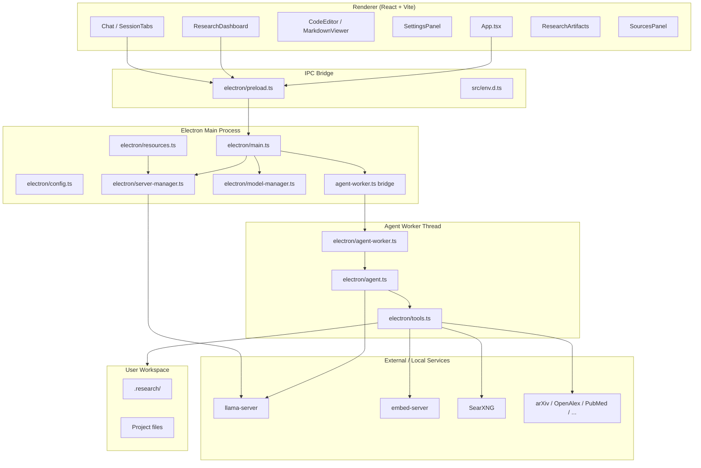
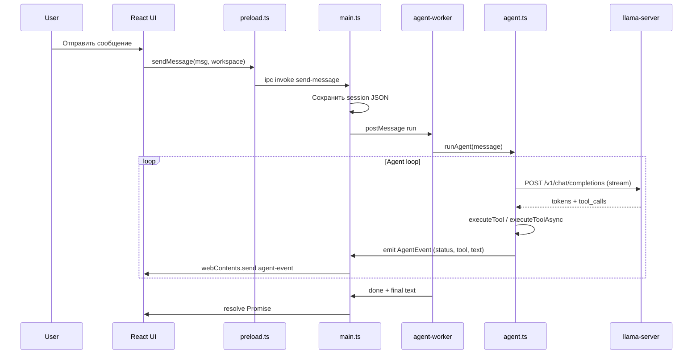
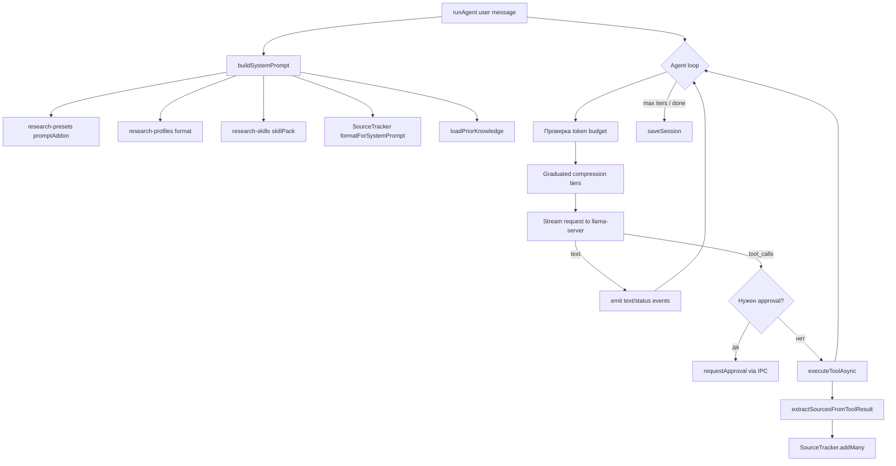
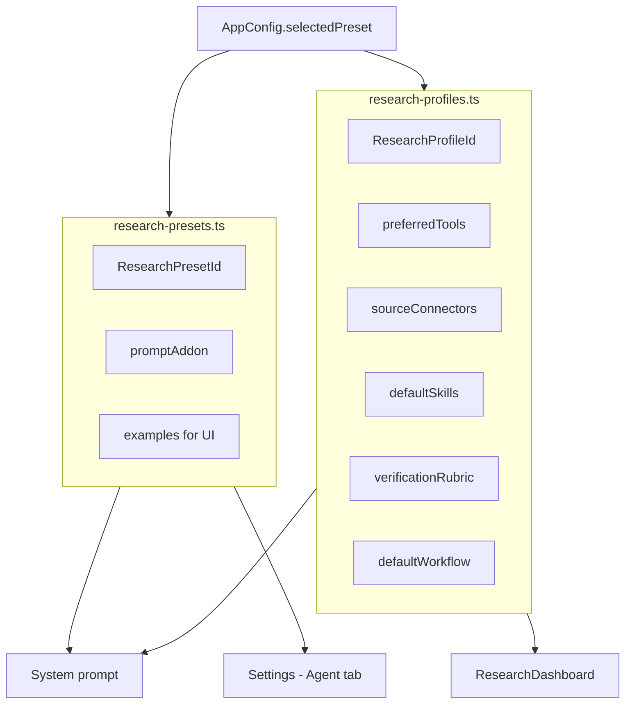
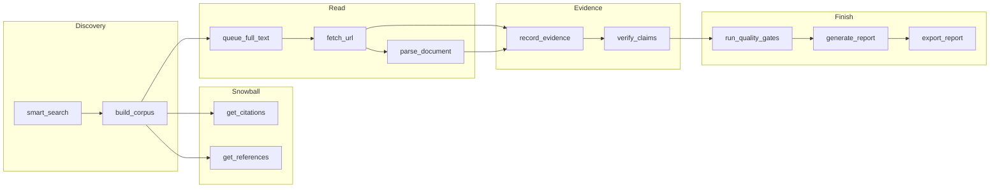
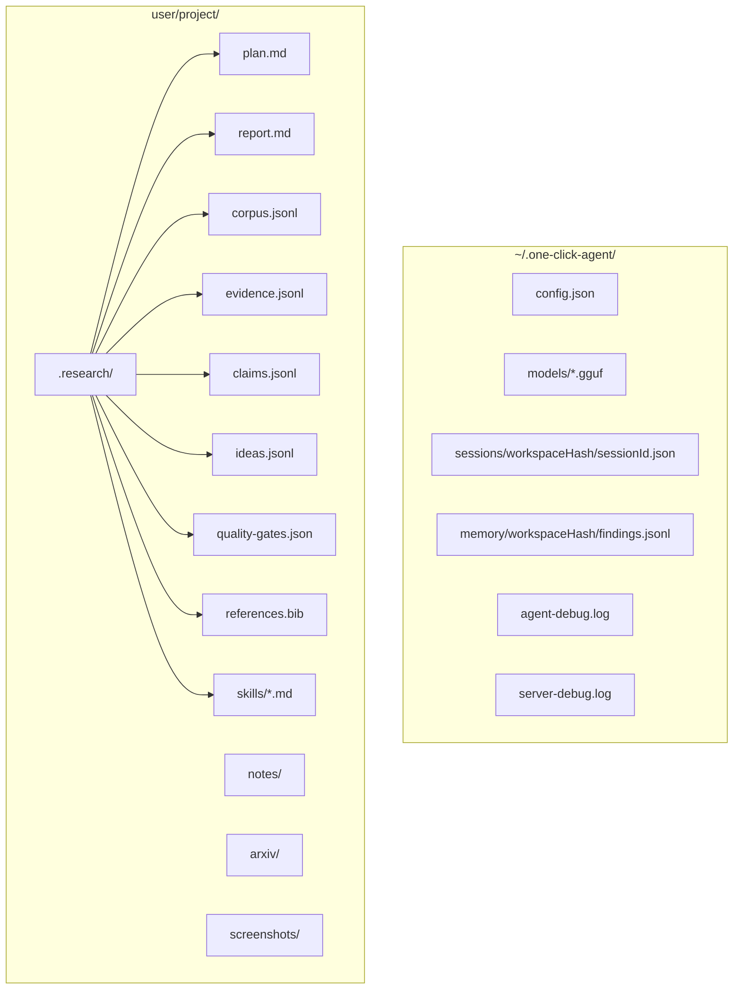
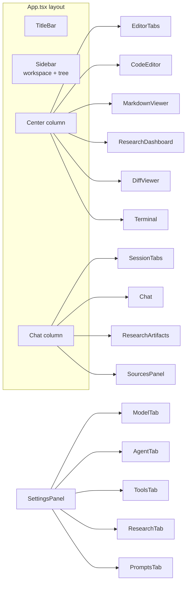

# Карта проекта One-Click Research Agent

Документ для быстрой ориентации в кодовой базе. Описывает архитектуру, ключевые модули, потоки данных, артефакты исследования и точки расширения.

> **Кратко:** local-first Electron-приложение с React UI, локальной LLM через `llama-server`, agent loop с инструментами, research-профилями и pipeline от поиска до evidence/report.

---

## Содержание

1. [Общая архитектура](#1-общая-архитектура)
2. [Структура репозитория](#2-структура-репозитория)
3. [Процессы и IPC](#3-процессы-и-ipc)
4. [Agent runtime](#4-agent-runtime)
5. [Research pipeline](#5-research-pipeline)
6. [Профили и пресеты](#6-профили-и-пресеты)
7. [Инструменты агента (tools)](#7-инструменты-агента-tools)
8. [Хранение данных](#8-хранение-данных)
9. [UI-компоненты](#9-ui-компоненты)
10. [Контекст и сжатие](#10-контекст-и-сжатие)
11. [Логи и диагностика](#11-логи-и-диагностика)
12. [Где что менять](#12-где-что-менять)

---

## 1. Общая архитектура



### Слои ответственности

| Слой | Назначение | Главные файлы |
|------|------------|---------------|
| **UI** | Редактор, чат, настройки, dashboard | `src/App.tsx`, `src/components/*`, `src/hooks/*` |
| **IPC** | Типизированный мост renderer ↔ main | `electron/preload.ts`, `src/env.d.ts` |
| **Main** | Окна, файлы, сервер LLM, сессии, IPC handlers | `electron/main.ts` |
| **Worker** | Agent loop без блокировки UI | `electron/agent-worker.ts` |
| **Agent core** | Промпт, контекст, tool loop, сессии | `electron/agent.ts` |
| **Tools** | Все действия агента | `electron/tools.ts` + доменные модули |
| **Research modules** | Corpus, evidence, skills, quality, ideas | `electron/corpus.ts`, `evidence.ts`, … |
| **Config / presets** | Поведение и доменные профили | `research-presets.ts`, `research-profiles.ts` |

---

## 2. Структура репозитория

```
one-click-research-agent/
├── docs/
│   └── PROJECT_MAP.md          ← этот документ
├── src/                        # React renderer (UI)
│   ├── App.tsx                 # Главный layout: sidebar + editor + chat
│   ├── main.tsx                # Точка входа React
│   ├── env.d.ts                # Типы window.api (ElectronAPI)
│   ├── hooks/
│   │   ├── useAgent.ts         # Чат, сессии, sendMessage, IPC events
│   │   ├── useEditor.ts        # Открытые файлы, tabs
│   │   └── useResizable.ts     # Resize панелей
│   ├── components/
│   │   ├── Chat.tsx            # Чат и empty state с примерами
│   │   ├── SessionTabs.tsx     # Вкладки сессий (+ новый чат)
│   │   ├── Sidebar.tsx         # Workspace, file tree
│   │   ├── SettingsPanel.tsx   # Model / Agent / Tools / Research / Prompts
│   │   ├── ResearchDashboard.tsx   # Центральный dashboard (без открытого файла)
│   │   ├── ResearchArtifacts.tsx # Plan + .research/ files в чате
│   │   ├── SourcesPanel.tsx    # Цитаты [1], [2] по сессии
│   │   ├── CodeEditor.tsx      # Monaco editor
│   │   ├── MarkdownViewer.tsx  # Просмотр/редактирование .md
│   │   └── ...
│   └── utils/
│       └── external-links.ts
│
├── electron/                   # Main process + worker + backend logic
│   ├── main.ts                 # IPC, окна, wiring всего backend
│   ├── preload.ts              # contextBridge → window.api
│   ├── agent.ts                # ★ Ядро agent loop
│   ├── agent-worker.ts         # Worker thread wrapper
│   ├── tools.ts                # ★ Определения и исполнение tools
│   ├── config.ts               # ~/.one-click-agent/config.json
│   ├── types.ts                # Shared TS types (AgentEvent, GpuInfo, …)
│   │
│   ├── server-manager.ts       # llama-server: start/stop/logs
│   ├── model-manager.ts        # Скачивание GGUF моделей
│   ├── resources.ts            # GPU/RAM, computeOptimalArgs
│   ├── gguf.ts                 # Парсинг метаданных GGUF
│   │
│   ├── sources.ts              # SourceTracker, парсеры search results
│   ├── memory.ts               # Persistent findings (jsonl)
│   ├── knowledge-index.ts      # BM25 + vector hybrid index
│   ├── planner.ts              # .research/plan.md
│   ├── sub-researcher.ts       # Изолированные sub-agents (search-only)
│   ├── query-router.ts         # smart_search routing
│   ├── search-cache.ts         # Кэш search/fetch
│   ├── url-fetch.ts            # fetch_url + Readability
│   ├── url-health.ts           # verify_sources / Wayback
│   ├── document-parser.ts      # PDF/DOCX → text
│   ├── export-report.ts        # PDF / DOCX / BibTeX
│   ├── screenshot.ts           # Headless screenshot via Electron
│   ├── searxng.ts              # Web search backend
│   ├── embed.ts                # Embedding server для vectors
│   │
│   ├── corpus.ts               # .research/corpus.jsonl
│   ├── evidence.ts             # .research/evidence.jsonl, claims.jsonl
│   ├── research-skills.ts      # JIT skills library
│   ├── quality-gates.ts        # Pre-report quality checks
│   ├── idea-scout.ts           # .research/ideas.jsonl
│   │
│   ├── git.ts                  # Git status для sidebar
│   ├── terminal-manager.ts     # node-pty terminals
│   └── ...
│
├── research-presets.ts         # Prompt addons + examples (UI preset id)
├── research-profiles.ts        # ResearchProfile: tools, connectors, rubric
├── package.json
├── vite.config.ts
├── tsconfig.json
├── README.md
└── README_EN.md
```

---

## 3. Процессы и IPC



### Основные IPC-каналы

| Категория | Метод `window.api.*` | Handler в `main.ts` |
|-----------|----------------------|---------------------|
| **Агент** | `sendMessage`, `cancelAgent`, `resetAgent` | `send-message`, `cancel-agent`, `reset-agent` |
| **Сессии** | `createSession`, `switchSession`, `listSessions`, … | `create-session`, … |
| **Конфиг** | `getConfig`, `saveConfig` | `get-config`, `save-config` |
| **Модель/сервер** | `autoSetup`, `restartServer`, `downloadModel` | `auto-setup`, `restart-server`, … |
| **Research** | `getResearchPlan`, `getResearchDashboard`, `listResearchArtifacts` | одноимённые handlers |
| **Sources** | `getSessionSources` | `get-session-sources` |
| **Knowledge** | `knowledgeIndexStats`, `knowledgeIndexRebuild` | `knowledge-index-*` |
| **Embed** | `embedStart`, `embedStop`, `embedStatus` | `embed-*` |
| **Файлы** | `readFileContent`, `writeFile`, `listFiles` | `read-file-content`, … |
| **Терминал** | `terminalCreate`, `terminalWrite` | `terminal-*` |

Полный контракт типов: `src/env.d.ts`.

---

## 4. Agent runtime

Файл: `electron/agent.ts` (~2800 строк) — центральный модуль.



### Ключевые концепции в `agent.ts`

| Концепция | Описание |
|-----------|----------|
| **Session** | `{ id, title, messages[], uiMessages[], workspaceKey }` — история LLM + UI state |
| **AgentBridge** | Абстракция для main vs worker: emit, approval, config, save session |
| **Working memory** | Структурированное извлечение plan/files/facts из истории |
| **SourceTracker** | Per-session источники с `[1]`, `[2]` для цитирования |
| **Approval** | `approvalForFileOps`, `approvalForCommands`, `approvalForPlans` |
| **Supervisor nudges** | `supervisorAutoReflectEvery`, auto verify before report |

### Worker vs Main

- **`electron/agent-worker.ts`** — запускает `runAgent` в отдельном потоке, чтобы UI не зависал.
- **`electron/main.ts`** — реализует `AgentBridge`: отправка events в renderer, approval dialogs, доступ к config/server.

---

## 5. Research pipeline

Целевой flow исследования (после roadmap-реализации):

```mermaid
flowchart LR
  Goal[User goal] --> Profile[Research Profile]
  Profile --> Plan["plan_research / plan.md"]
  Plan --> Search["smart_search / domain tools"]
  Search --> Corpus["build_corpus / corpus.jsonl"]
  Corpus --> Snowball["get_citations / get_references"]
  Snowball --> Read["fetch_url / parse_document / arxiv download"]
  Read --> Evidence["record_evidence / evidence.jsonl"]
  Evidence --> Reflect[reflect]
  Reflect --> Gates[run_quality_gates]
  Gates --> Report["generate_report / report.md"]
  Report --> Export["export_report PDF DOCX BibTeX"]
  Gates --> Ideas["scout_ideas / ideas.jsonl"]
```



### Research-модули

| Модуль | Файл | Артефакт | Назначение |
|--------|------|----------|------------|
| **Planner** | `planner.ts` | `.research/plan.md` | Чеклист sub-questions |
| **Corpus builder** | `corpus.ts` | `.research/corpus.jsonl` | Dedup DOI/arXiv/PMID/URL, ranking, full-text queue |
| **Evidence graph** | `evidence.ts` | `.research/evidence.jsonl`, `claims.jsonl` | Claim ↔ source ↔ confidence |
| **Skills** | `research-skills.ts` | built-in + `.research/skills/*.md` | JIT workflow instructions |
| **Quality gates** | `quality-gates.ts` | `.research/quality-gates.json` | Coverage, recency, claim support |
| **Idea Scout** | `idea-scout.ts` | `.research/ideas.jsonl` | Idea cards, gaps, prioritization |
| **Sources** | `sources.ts` | in-memory per session | `[N]` citations, UI SourcesPanel |
| **Memory** | `memory.ts` | `~/.one-click-agent/memory/` | Cross-session findings |
| **Knowledge index** | `knowledge-index.ts` | workspace index dir | BM25 + vectors hybrid recall |
| **Sub-researcher** | `sub-researcher.ts` | — | До 3 параллельных search-only agents |

---

## 6. Профили и пресеты

Два связанных, но разных слоя:



### Пресеты (`research-presets.ts`)

UI-идентификатор в настройках → prompt addon.

| ID | Label |
|----|-------|
| `universal` | Universal Research |
| `deep-research` | Deep Research (multi-phase workflow) |
| `ml-ai` | ML/AI Research |
| `arxiv-papers` | Arxiv Papers |
| `opensource-analysis` | Open Source App Analysis |
| `biology` | Biology Research |
| `mathematics` | Math Research |
| `finance` | Finance Research |
| `paper-reproduction` | Paper Reproduction |

### Профили (`research-profiles.ts`)

Bundle поверх пресета: tools, connectors, skills, rubric, UI defaults.

| Profile ID | Домен | Связанные presets |
|------------|-------|-------------------|
| `universal` | general | universal, deep-research |
| `ml-ai` | machine-learning | ml-ai, arxiv-papers, opensource-analysis |
| `biology` | biology | biology |
| `mathematics` | mathematics | mathematics |
| `finance` | finance | finance |
| `paper-reproduction` | reproducibility | paper-reproduction |

**Source connectors** имеют статус: `available` | `planned` | `external`.

---

## 7. Инструменты агента (tools)

**Всего встроенных tools:** 49 (+ custom tools из `AppConfig.customTools`).

Определения: `electron/tools.ts` → `TOOL_DEFINITIONS`.  
Исполнение: `executeTool()` (sync) / `executeToolAsync()` (async).  
Agent loop всегда вызывает `executeToolAsync()`; sync-tools исполняются через fallback внутри неё.

```mermaid
flowchart TB
  ROOT["Agent Tools (49)"]

  subgraph files ["Files and Workspace (10)"]
    files_list["read_file · write_file · edit_file · append_file · delete_file · create_directory · list_directory · find_files · parse_document · execute_command"]
  end

  subgraph search ["Search and Fetch (11)"]
    search_list["smart_search · search_arxiv · search_openalex · search_crossref · search_semantic_scholar · search_pubmed · search_huggingface_papers · search_web · fetch_url · download_arxiv_html · download_arxiv_pdf"]
  end

  subgraph plan ["Plan and Corpus (7)"]
    plan_list["plan_research · update_plan_status · build_corpus · list_corpus · queue_full_text · get_citations · get_references"]
  end

  subgraph evidence ["Evidence and Quality (8)"]
    evidence_list["record_evidence · list_evidence · evidence_matrix · verify_claims · run_quality_gates · gate_report · verify_sources · reflect"]
  end

  subgraph memory ["Memory and Index (3)"]
    memory_list["save_finding · recall_findings · search_knowledge"]
  end

  subgraph report ["Report and Export (2)"]
    report_list["generate_report · export_report"]
  end

  subgraph ideas ["Ideas (3)"]
    ideas_list["scout_ideas · prioritize_ideas · save_idea"]
  end

  subgraph agents ["Agents and Skills (4)"]
    agents_list["spawn_sub_researcher · list_research_skills · load_research_skill · list_domain_connectors"]
  end

  subgraph visual ["Visual (1)"]
    visual_list["screenshot_page"]
  end

  ROOT --> files
  ROOT --> search
  ROOT --> plan
  ROOT --> evidence
  ROOT --> memory
  ROOT --> report
  ROOT --> ideas
  ROOT --> agents
  ROOT --> visual
```



### Tool → модуль (где искать реализацию)

| Tool | Основной файл | Примечание |
|------|---------------|------------|
| `read_file` … `delete_file`, `execute_command` | `electron/tools.ts` | inline helpers |
| `parse_document` | `electron/document-parser.ts` | PDF/DOCX |
| `smart_search` | `electron/tools.ts` + `electron/query-router.ts` | router + fan-out |
| `search_arxiv` … `search_pubmed` | `electron/tools.ts` | fetch via child Node script |
| `search_web` | `electron/tools.ts` + `electron/searxng.ts` | SearXNG backend |
| `fetch_url` | `electron/url-fetch.ts` | Readability |
| `download_arxiv_*` | `electron/tools.ts` | local `.research/arxiv/` |
| `plan_research`, `update_plan_status` | `electron/planner.ts` | `.research/plan.md` |
| `build_corpus`, `list_corpus`, `queue_full_text` | `electron/corpus.ts` | `.research/corpus.jsonl` |
| `get_citations`, `get_references` | `electron/tools.ts` | OpenAlex API |
| `record_evidence`, `list_evidence`, `evidence_matrix`, `verify_claims` | `electron/evidence.ts` | `.research/evidence.jsonl` |
| `run_quality_gates`, `gate_report` | `electron/quality-gates.ts` | `.research/quality-gates.json` |
| `verify_sources` | `electron/url-health.ts` | Wayback fallback |
| `reflect` | `electron/tools.ts` | prompt template для self-critique |
| `save_finding`, `recall_findings` | `electron/memory.ts` | `~/.one-click-agent/memory/` |
| `search_knowledge` | `electron/knowledge-index.ts` | BM25 + vectors |
| `generate_report` | `electron/tools.ts` + `electron/sources.ts` | References из tracker |
| `export_report` | `electron/export-report.ts` | PDF/DOCX/BibTeX |
| `scout_ideas`, `prioritize_ideas`, `save_idea` | `electron/idea-scout.ts` | `.research/ideas.jsonl` |
| `spawn_sub_researcher` | `electron/sub-researcher.ts` | max 3 parallel |
| `list_research_skills`, `load_research_skill` | `electron/research-skills.ts` | + `.research/skills/*.md` |
| `list_domain_connectors` | `research-profiles.ts` | profile sourceConnectors |
| `screenshot_page` | `electron/screenshot.ts` | Electron BrowserWindow |
| **Все search results → sources** | `electron/sources.ts` | `extractSourcesFromToolResult()` |
| **Custom tools** | `electron/tools.ts` → `executeCustomTool()` | `AppConfig.customTools` |

### Полный каталог по категориям

#### Files & Workspace (10)

| Tool | Sync | Session | Назначение |
|------|:----:|:-------:|------------|
| `read_file` | ✓ | | Чтение файла с номерами строк, offset/limit |
| `write_file` | ✓ | | Создать или полностью перезаписать файл |
| `edit_file` | ✓ | | Точечная замена exact string match |
| `append_file` | ✓ | | Дописать в конец файла |
| `delete_file` | ✓ | | Удалить файл |
| `create_directory` | ✓ | | Создать директорию (recursive) |
| `list_directory` | ✓ | | Дерево файлов с depth |
| `find_files` | ✓ | | Glob по имени или regex по содержимому |
| `parse_document` | ✓ | | PDF/DOCX → text + metadata |
| `execute_command` | ✓ | | Shell-команда в workspace (timeout 120s) |

#### Search & Fetch (11)

| Tool | Sync | Session | Назначение |
|------|:----:|:-------:|------------|
| `smart_search` | ✓ | | Query router → 2–3 engines параллельно, dedup URL |
| `search_arxiv` | ✓ | | arXiv API, date filters, sort |
| `search_openalex` | ✓ | | OpenAlex works, DOI, citations |
| `search_crossref` | ✓ | | Crossref bibliographic metadata |
| `search_semantic_scholar` | ✓ | | Semantic Scholar graph |
| `search_pubmed` | ✓ | | Europe PMC / PubMed |
| `search_huggingface_papers` | ✓ | | HF Papers + linked repos |
| `search_web` | ✓ | | SearXNG (если настроен) |
| `fetch_url` | ✓ | | URL → markdown (Readability), arXiv auto-detect |
| `download_arxiv_html` | ✓ | | Скачать arXiv HTML в workspace |
| `download_arxiv_pdf` | ✓ | | Скачать arXiv PDF в workspace |

> Результаты search tools парсятся в `sources.ts` → `SourceTracker` → цитаты `[1]`, `[2]` в UI.

#### Plan & Corpus (7)

| Tool | Sync | Session | Артефакт | Назначение |
|------|:----:|:-------:|----------|------------|
| `plan_research` | ✓ | ✓ | `plan.md` | Декомпозиция вопроса → checklist |
| `update_plan_status` | ✓ | | `plan.md` | Отметить Q1/Q2… done/undone |
| `build_corpus` | ✓ | ✓ | `corpus.jsonl` | Session sources → dedup/rank corpus |
| `list_corpus` | ✓ | | | Показать ranked corpus |
| `queue_full_text` | ✓ | | | Поставить items в очередь full-text |
| `get_citations` | ✓ | | | OpenAlex: кто цитирует work |
| `get_references` | ✓ | | | OpenAlex: references work |

#### Evidence & Quality (8)

| Tool | Sync | Session | Артефакт | Назначение |
|------|:----:|:-------:|----------|------------|
| `record_evidence` | ✓ | ✓ | `evidence.jsonl` | Claim + sources + quote + confidence |
| `list_evidence` | ✓ | | | Список evidence rows |
| `evidence_matrix` | ✓ | | | Markdown-таблица claims × sources |
| `verify_claims` | ✓ | ✓ | | Проверка orphan/weak claims |
| `run_quality_gates` | ✓ | ✓ | `quality-gates.json` | Battery: coverage, recency, plan, evidence |
| `gate_report` | ✓ | ✓ | | Human-readable gate report |
| `verify_sources` | ✓ | ✓ | | URL health + Wayback fallback |
| `reflect` | ✓ | ✓ | | Self-critique: gaps, bias, recency |

#### Memory & Index (3)

| Tool | Sync | Session | Назначение |
|------|:----:|:-------:|------------|
| `save_finding` | ✓ | ✓ | Persistent finding → `~/.one-click-agent/memory/` |
| `recall_findings` | **async** | | Hybrid recall: keyword log + BM25/vector index |
| `search_knowledge` | **async** | | Hybrid search по workspace index |

#### Report & Export (2)

| Tool | Sync | Session | Артефакт | Назначение |
|------|:----:|:-------:|----------|------------|
| `generate_report` | ✓ | ✓ | `report.md` | Markdown report + References из tracker |
| `export_report` | **async** | ✓ | `.pdf/.docx/.bib` | PDF (Chromium), DOCX, BibTeX |

#### Ideas (3)

| Tool | Sync | Session | Артефакт | Назначение |
|------|:----:|:-------:|----------|------------|
| `scout_ideas` | ✓ | | `ideas.jsonl` | Idea cards из corpus/evidence + topic |
| `prioritize_ideas` | ✓ | | | Rank по novelty+feasibility+impact |
| `save_idea` | ✓ | | | Ручное сохранение idea card |

#### Agents, Skills & Domain (4)

| Tool | Sync | Session | Назначение |
|------|:----:|:-------:|------------|
| `spawn_sub_researcher` | **async** | ✓ | Изолированный search-only sub-agent (max 3) |
| `list_research_skills` | ✓ | | Built-in + `.research/skills/*.md` |
| `load_research_skill` | ✓ | | JIT загрузка полного skill prompt |
| `list_domain_connectors` | ✓ | | Connectors профиля (biology, ML, …) |

#### Visual (1)

| Tool | Sync | Session | Назначение |
|------|:----:|:-------:|------------|
| `screenshot_page` | **async** | | Headless PNG через Electron BrowserWindow |

### Рекомендуемые цепочки (research workflow)



### Async-only tools

```typescript
// electron/tools.ts
ASYNC_ONLY_TOOLS = [
  'search_knowledge',
  'spawn_sub_researcher',
  'screenshot_page',
  'export_report',
  'recall_findings',
]
```

Все остальные 44 tool — sync (но agent loop вызывает их через `executeToolAsync` → fallback на `executeTool`).

### Session-aware tools

Автоматически получают `session_id` в agent loop:

`generate_report`, `verify_sources`, `reflect`, `plan_research`, `save_finding`, `spawn_sub_researcher`, `export_report`, `build_corpus`, `record_evidence`, `verify_claims`, `run_quality_gates`, `gate_report`.

### Custom tools

Пользовательские tools из Settings → Tools:

- Описание + shell-команда с `{{param}}` placeholders
- Выполняются через `executeCustomTool()` в `tools.ts`
- Могут требовать approval (file ops / commands flags)

### Как добавить новый tool

1. Добавить JSON Schema в `TOOL_DEFINITIONS`.
2. Реализовать handler в `executeTool` / `executeToolAsync`.
3. При необходимости — парсер в `sources.ts` → `PARSERS`.
4. Session-aware → добавить в `SESSION_AWARE_TOOLS` в `agent.ts`.
5. Async → добавить в `ASYNC_ONLY_TOOLS`.
6. Упомянуть в preset/profile/skill prompt.

---

## 8. Хранение данных



| Путь | Что хранит |
|------|------------|
| `~/.one-click-agent/config.json` | Модель, ctx, preset, approvals, web search, embed |
| `~/.one-click-agent/sessions/<ws>/<id>.json` | LLM messages + uiMessages |
| `~/.one-click-agent/memory/<ws>/` | Persistent findings между сессиями |
| `<workspace>/.research/plan.md` | Research plan (checkboxes) |
| `<workspace>/.research/corpus.jsonl` | Ranked corpus entries |
| `<workspace>/.research/evidence.jsonl` | Claim-evidence rows |
| `<workspace>/.research/ideas.jsonl` | Idea Scout cards |
| `<workspace>/.research/report.md` | Final report |

---

## 9. UI-компоненты



| Компонент | Роль |
|-----------|------|
| `ResearchDashboard.tsx` | Показывается в центре, когда нет открытого файла: profile, plan/corpus/evidence stats |
| `ResearchArtifacts.tsx` | Collapsible панель в чате: plan progress + файлы `.research/` |
| `SourcesPanel.tsx` | Список источников сессии, health status |
| `SettingsPanel.tsx` → Agent | Выбор preset + preview profile connectors |
| `Chat.tsx` | Empty state, example chips, streaming messages |
| `useAgent.ts` | Orchestration: sessions, sendMessage, agent events |

---

## 10. Контекст и сжатие

Agent использует **graduated compression** при заполнении context window:

| Tier | Порог (от budget) | Действие |
|------|-------------------|----------|
| 1 | 35% | Сжатие tool results |
| 2 | — | Сжатие tool call chains |
| 3 | 55% | LLM summarization |
| 4 | 80% | Aggressive prune |
| Emergency | 92% | Emergency prune |

Дополнительно:

- **Working memory** — plan, files, facts, questions из истории.
- **SourceTracker** — sources переживают compression (инжектятся в system prompt).
- **`.research/` writes** — промежуточные результаты сохраняются на диск, чтобы не терять при prune.
- **Token counting** — `/tokenize` endpoint llama-server с heuristic fallback.

---

## 11. Логи и диагностика

| Файл | Содержимое |
|------|------------|
| `~/.one-click-agent/agent-debug.log` | Agent loop, errors, context, tool calls |
| `~/.one-click-agent/server-debug.log` | llama-server: args, stdout/stderr, exit code |
| Console main process | `[restart-server]`, `[auto-setup]`, IPC |

При `fetch failed` / обрыве stream → смотреть **оба** лога; `server-debug.log` показывает OOM/crash llama-server.

---

## 12. Где что менять

| Задача | Куда идти |
|--------|-----------|
| Новый research preset (prompt) | `research-presets.ts` |
| Новый domain profile | `research-profiles.ts` |
| Новый tool | `electron/tools.ts` + опционально доменный модуль |
| Парсинг URL из search results | `electron/sources.ts` |
| UI настроек агента | `src/components/SettingsPanel.tsx` → `AgentTab` |
| Research dashboard | `src/components/ResearchDashboard.tsx` + IPC `get-research-dashboard` |
| IPC API | `electron/main.ts` → `electron/preload.ts` → `src/env.d.ts` |
| GPU/ctx расчёт | `electron/resources.ts` |
| llama-server lifecycle | `electron/server-manager.ts` |
| Web search | `electron/searxng.ts` |
| Sub-agent behavior | `electron/sub-researcher.ts` |
| Hybrid memory search | `electron/knowledge-index.ts`, `electron/embed.ts` |
| Quality checks | `electron/quality-gates.ts` |
| Skills / workflows | `electron/research-skills.ts`, `.research/skills/` |

### Типичный dev flow

```bash
npm install
npm run dev
```

1. Setup wizard поднимет модель и llama-server.
2. Открыть workspace (папку проекта).
3. Settings → Agent → выбрать preset/profile.
4. В чате: search → `build_corpus` → `record_evidence` → `run_quality_gates` → report.
5. Dashboard в центре и ResearchArtifacts внизу чата покажут прогресс.

---

## Связанные документы

- [README.md](../README.md) — установка, первый запуск, примеры запросов
- [README_EN.md](../README_EN.md) — English version
- Research roadmap plan — `.cursor/plans/research-agent-roadmap*.plan.md` (если есть локально)

---

*Последнее обновление карты: отражает состояние после внедрения Research Profiles, corpus/evidence pipeline, skills, quality gates, Idea Scout и ResearchDashboard.*
